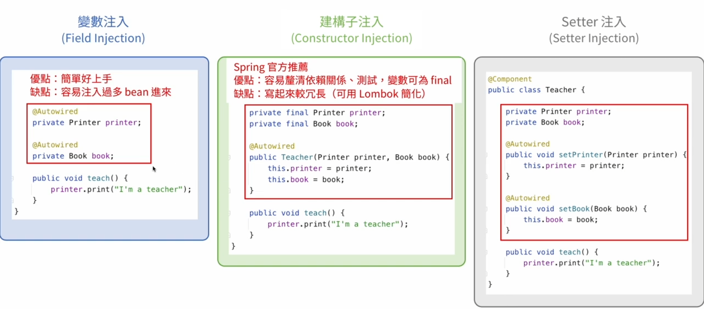
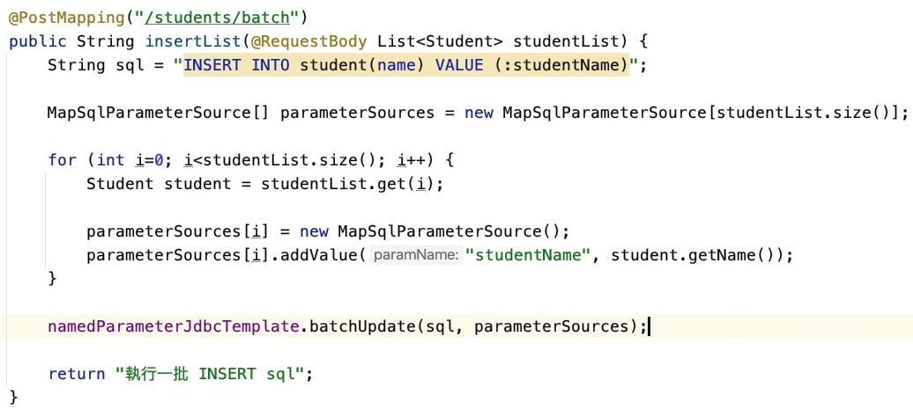
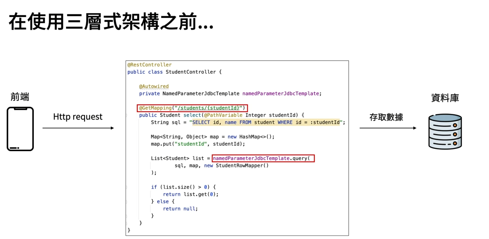
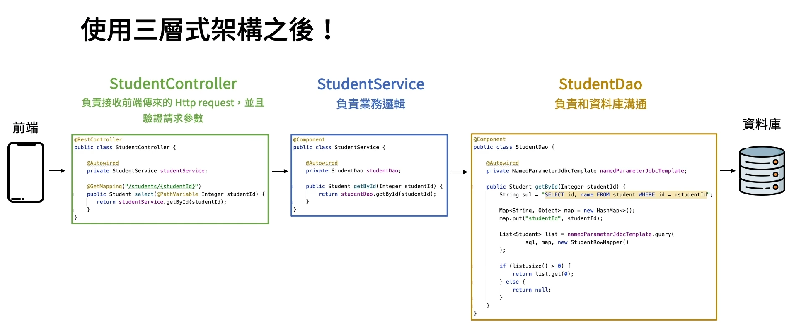
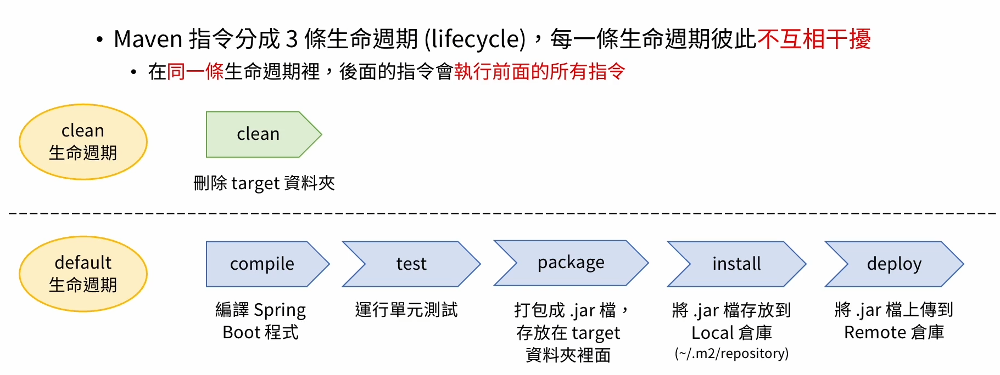

# Spring IoC
* 2-4 創建Bean方法
1. @Component 
加上Component可以讓該class直接變成一個Bean
2. @Configuration + @Bean
   @Configuration:將此class變成Spring用的class
   @Bean:  1.只能加在@Configuration class底下，用於創建一個Bean
           2.Bean的名稱: if @Bean("XXX")
                        else function name
@Autowired 會根據變數類型去spring容器中尋找合適的Bean，所以使用interface會比較好
* 2-3 Bean的注入
  1. 當一個interface有多個implement時，可藉由@Qualifier指定哪一個implement
    <pre><code>
    public interface Animal {
        void sound();
    }
    
    @Component
    public class Dog implements Animal {
        @Override
        public void sound() {
            System.out.println("Bark");
        }
    }
    
    @Component
    public class Cat implements Animal {
        @Override
        public void sound() {
            System.out.println("Meow");
        }
    }
    
    ================================================================
    @Component
    public class AnimalService {
        private final Animal animal;
    
        @Autowired
        public AnimalService(@Qualifier('Dog') Animal animal){
            this.animal = animal;
        }
    }
    </code></pre> 
  2. 各種Injection方法
    * Field Injection: 直接注入Object進變數內
    * Constructor Injection: 透過建構子方式將Bean注入變數內
    
# Aop
旨在透過將橫切關注點（cross-cutting concerns）從主要業務邏輯中分離出來
1. 藉由代理模式在調用object某個function之時，執行介面插入邏輯
2. 有分動態代理和代理靜態代理
* 動態代理: 運行時動態產生代理類別和對象
* 靜態代理: 編譯時創建的，代理類是手動編寫的，針對特定的目標類

# Spring MVC
* 4-3~4-10 http method 和 method參數 和 header資訊
1. RequestMapping HTTP所有的請求映射到方法
2. RequestParam 取得get方法的url變數，ex: /hello=12&world='abc'
3. RequestBody 用於取得post、put content
4. RequestHeader 取得前端的header資訊
5. PathVariable 取得放在url路徑裡的變數 ，ex:{id}

* 4-13 驗證:
// request驗證註解: @Min、@Count
1. 方法一 : @Valid (Controller內的Function) + request驗證註解 (Entity)
   1. 使用@Valid的話，spring會到entity去檢查notNull...等配置
   2. 用於RequestBody
2. 方法二 : @Validated(加在class上) + request驗證註解(放於Function內) 皆可放於controller內
   1. 用於RequestParam、RequestHeader、PathVariable

* 4-14 ResponseEntity<{自定義型態}>:
  1.  自定Function內所返回的http response，還有自定義response status
  2.  作為Restful function的返回型態

* 4-15 @ControllerAdvice + @ExceptionHandler({錯誤種類})               底層透過AOP所實作
* 自訂function內throw error的http狀態碼以及其返回response內容
* 使用@ExceptionHandler告訴Spring boot該處理哪種錯誤，"注意!!!!!" {錯誤種類}必須和ResponseEntity的function參數一致
* @ExceptionHandler會透過Throwable的繼承關係一層一層自動地往父層找，Ex:若throw出來的Error沒有定義@ExceptionHandler，則會透過Spring Boot一層一層往該父層找

* 4-16 Interceptor 需要 implement HandlerInterceptor
* 1.攔截無效的前端的http request，幫後端處理(前 or 後)做一個篩選 ----可使用 preHandle or postHandle。
* 若為 true 則可通過 Interceptor 執行接下來的步驟
* 若為 false 則被 Interceptor 擋下來，無法執行接下步驟
* 2.需要建立Interceptor對應到的網址config程式

# JDBC資料庫連線
* 5-6 NamedParameterJdbcTemplate
1. 新增 NamedParameterJdbcTemplate.update(String: sql,Map map)
2. 查詢 
* NamedParameterJdbcTemplate.query(String: sql,Map map,RowMapper entityRowMapper)
     會需要RowMapper是因為從資料庫返回的record Java不認識，所以需透過RowMapper將record轉為Java Object
*  NamedParameterJdbcTemplate.queryForObject(String: sql,Map map, Integer.class)
    1. 用於返回單個對象 
    2. 通常用於select count(*) from 
3. 刪除 NamedParameterJdbcTemplate.update(String: sql,Map map)
4. 更新 NamedParameterJdbcTemplate.update()

* 5-5 update進階用法
1. 取得table自動生成的id
<pre><code>
KeyHolder keyHolder = new GeneratedKeyHolder();
Map<String , Object> map = new HashMap<>();
map.put("studentName", student.getName());
namedParameterJdbcTemplate.update(sql, new MapSqlParameterSource(map),keyHolder);
/*
MapSqlParameterSource為實現map interface的其中一個class，專門用於JDBC的 SQL 查询和更新操作中的命名参数
1. 用於執行帶有便樹命名參數的SQL查詢或更新
2. 提供特定方法: addValue、registerSqlType 方便設置參數名稱和型態
3. 使用addValue 更能在編譯時安全地進行類型檢查，確保與DB內的類型匹配
4. 能在MultiThread下安全地調用，不像Map會有併發的問題
*/

int id = KeyHolder.getKey().intValue(); // 取得動態生成的key
</code></pre>

2. 如何批量執行insert/update/delete

# JPA資料庫連線
* 6-4 JpaRepository 
透過建立JpaRepository可操作CRUD和Sorting、Paging等功能，JpaRepository本身提供flush操作
1. 新增和修改 repository.save(object)
2. 刪除 repository.deleteById(Id)
3. 搜尋 repository.findById(Id)

* 5-8 MVC架構模式
* 軟體工程的一種軟體架構
    * Controller:
    1. 負責轉發Http Request 
    2. 驗證請求參數
    * Model :
    1. 定義:負責業務邏輯、數據處理，因為有數據的處理所以需要和資料庫做溝通
    2. 流程:透過Controller的轉發    定義:負責業務邏輯、數據處理，因為有數據的處理所以需要和資料庫做溝通
    * View :
    1. 定義:使用Html模板呈現數據，但現在流行使用Json格式來傳遞數據 所以現在View已越來越不重要
    2. 流程:透過Controller的轉發
    * 好處:
    1. 職責分離可以更好的維護程式
    2. 可重複使用「寫好的程式」
    * 套用到Spring boot上會變成Controller-Service-Dao 三層式架構:
    1. Controller: 
       1. 負責接收http request 
       2. 驗證請求參數
       3. Controller是不能直接call Dao，只能透過Service去Call Dao
    2. Service: 負責業務邏輯
    3. Dao (Data access object): 
       1. 負責和資料庫溝通
       2. 只能去執行Sql，存取資料庫內部的數據，不能添加任何業務邏輯
       
       

* 5-11 @Transactional 交易管理
用以確保在class or function執行期間事務的一致性和完整性。 **透過class or function執行完成後commit or rollback。**

Http status
* 1XX: 資訊
* 2XX: 成功
* 3XX: 重新導向
* 4XX: 前端請求有錯誤
    1. 400 Request參數有錯誤
    2. 401 沒通過身分驗證
    3. 403 權限不足
    4. 404 網頁不存在，可能資源被移走或是url輸入錯誤
* 5XX: 後端處理有問題
    1. 500 後端程式有bug，導致執行時發生錯誤
    2. 503 由於流量太大，後端沒辦法處理請求
    3. 504 (gateway timeout) 請求超時

# Maven指令
每個生命週期互相獨立，且同一生命週期的後面指令會先執行前面的指令

# Struts2和Spring MVC差異
* Struts2
1. 入口是filter
2. class級別的interceptor 
3. 對應Action
4. 需要非常多的xml配置才能做到Spring MVC效果
* Spring MVC
1. 入口是servlet
2. function級別的interceptor
3. 對應Bean
4. 零配置

# 好用的套件
1. org.slf4j.Logger  用於紀錄class內所發生的資訊
   <pre><code>

   public class SampleController{
    private final static Logger log = LoggerFactory.getLogger(SampleController.class);
    1.log.info("取得變數:{}",parameter);
    2.log.warn(); //警告
    3.log.error(); //運行出現問題
   
   }
   
   </code></pre>
2. com.fasterxml.jackson.databind.ObjectMapper 將Json、Map、List..等集合類型做轉換  

         ObjectMapper objectMapper = new ObjectMapper();
* Java object 轉 Json String
objectMapper.writeValueAsString(object);
* Json String轉Java object
String json = "{\"id\":3,\"name\":\"Amy\"}";
objectMapper.readValue(json, Object.class);
* 在Json中指定key名稱，使用這個註解後"在Json中" 原本的屬性將會被忽略
<pre><code>
  public class XXXX{
  @JsonProperty("自定義名稱")
  String customize;
 }
</code></pre>
* 將Json的Null值自動過濾掉
<pre><code>
@JsonInclude(JsonInclude.Include.NON_NULL)
public class XXXX{}
</code></pre>
* 忽略Json字串中多出來的Key
<pre><code>
@JsonIgnoreProperties(ignoreUnKnown = true)
public class XXXX{}
</code></pre>

3.org.springframework.web.client.RestTemplate  在Spring Boot發出 Http Request
#### RestTemplate restTemplate = new RestTemplate();

* getForObject(String: url,objectType: XXX.class,Map: ParameterMap) //ParameterMap為放在url後面的請求參數   返回單一Object
* getForEntity(String: url,object: XXX.class,Map: ParameterMap) 返回整個ResponseEntity
* exchange(url,HttpMethod.GET,HttpEntity,object: XXX.class,ParameterMap) //HttpEntity 裡面放request header